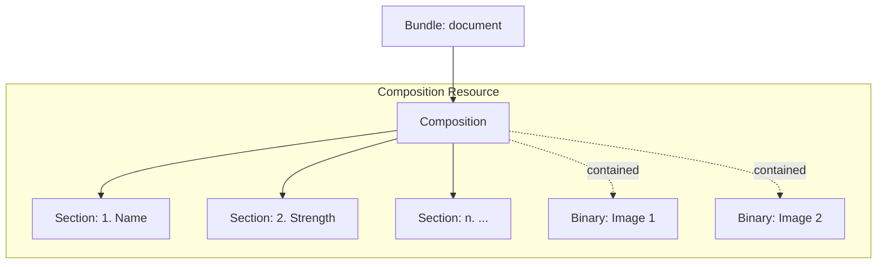

## Building ePI Type 1
ePI Type 1 focusess on the **Narrative Reproduction** of official label templates (e.g., Summary of Product Characteristics, Patient Information Leaflet). It serves as the digital replacement for traditional DOCX or PDF labels.

### Structural Outline
The ePI Type 1 document is a FHIR Bundle containing a Composition (the narrative backbone). Any necessary images are **contained** within the Composition as Binary resources.

#### Key Elements Checklist
*   **[Bundle]**
    *   `id`: Unique logical ID for the resource.
    *   `meta`: Must include `versionId`, `lastUpdated`, and `profile` (e.g., `bundle-epi-type1`).
    *   `type`: Must be set to `document`.
    *   `identifier`: Unique business ID for the document instance.
    *   `timestamp`: The date/time the bundle was assembled.
    *   `entry`: Reference to the `Composition` resource.
*   **[Composition]**
    *   `status`: Workflow state (e.g., `preliminary`, `final`).
    *   `type`: Identifies the document type (e.g., SmPC, PIL).
    *   `subject`: Link to the associated medicinal product.
    *   `date`: The official authorization or revision date.
    *   `author`: The Organization responsible for the content.
    *   `title`: The human-readable title of the document.
    *   `contained`: List of `Binary` image resources.
    *   `section`: Hierarchical sections containing the XHTML narrative.
*   **[Binary]**
    *   `contentType`: The image MIME type (SVG preferred).
    *   `data`: The Base64-encoded image data.

### Resource & Element Details
The following table maps the core resources to their purpose and specific implementation requirements in Type 1.

<table style="width:100%; border-collapse: collapse; border: 1px solid #d0d0d0; font-family: -apple-system, BlinkMacSystemFont, 'Segoe UI', Roboto, Helvetica, Arial, sans-serif; font-size: 14px; margin-bottom: 24px;">
  <thead>
    <tr style="background-color: #003087; color: #ffffff;">
      <th style="padding: 12px; border: 1px solid #d0d0d0; text-align: left; width: 20%;">Resource</th>
      <th style="padding: 12px; border: 1px solid #d0d0d0; text-align: left; width: 30%;">Purpose</th>
      <th style="padding: 12px; border: 1px solid #d0d0d0; text-align: left;">Key Elements & Notes</th>
    </tr>
  </thead>
  <tbody>
    <tr>
      <td style="padding: 10px; border: 1px solid #d0d0d0;"><strong>Bundle</strong></td>
      <td style="padding: 10px; border: 1px solid #d0d0d0;">The physical container for the ePI document.</td>
      <td style="padding: 10px; border: 1px solid #d0d0d0;">Must use <code>type: document</code>. The first entry must be the <code>Composition</code>. Any referenced <code>Binary</code> resources must also be included in the entries.</td>
    </tr>
    <tr>
      <td style="padding: 10px; border: 1px solid #d0d0d0;"><strong>Composition</strong></td>
      <td style="padding: 10px; border: 1px solid #d0d0d0;">Organizes the narrative structure.</td>
      <td style="padding: 10px; border: 1px solid #d0d0d0;">Uses <code>section.code</code> to identify standard sections (e.g., dosage). <code>section.text</code> contains the <code>div</code> with XHTML content.</td>
    </tr>
    <tr>
      <td style="padding: 10px; border: 1px solid #d0d0d0;"><strong>Binary</strong></td>
      <td style="padding: 10px; border: 1px solid #d0d0d0;">Stores embedded media.</td>
      <td style="padding: 10px; border: 1px solid #d0d0d0;">Images are stored as Base64. SVG is the preferred format for accessibility and scalability.</td>
    </tr>
  </tbody>
</table>

### Conceptual Workflow
While implementation may vary based on your tech stack, the general flow for building a Type 1 ePI is:

1.  **Extract Narrative**: Convert existing label content into clean, semantic XHTML.
2.  **Prepare Media**: Convert images to SVG and encode as Base64 for the `Binary` resources.
3.  **Define Structure**: Create the `Composition` resource, mapping narrative sections to the correct regulatory codes.
4.  **Assemble Bundle**: Package the `Composition` and `Binary` resources into a `Bundle`.
5.  **Validate**: Verify against the [Type 1 Profile](./profiles.md) to ensure compliance.

### Implementation Examples
Refer to the following examples for a technical starting point:
- **[JSON Example: SmPC Type 1](bundle-epi-type1-example-paracetamol.html)** ([Source](https://github.com/HL7/emedicinal-product-info/blob/master/input/examples/bundle-epi-type1-example-paracetamol.json)){:target="_blank"}
- **[JSON Example: PIL Type 1](bundle-epi-type1-example-paracetamol.html)** ([Source](https://github.com/HL7/emedicinal-product-info/blob/master/input/examples/bundle-epi-type1-example-paracetamol.json)){:target="_blank"}