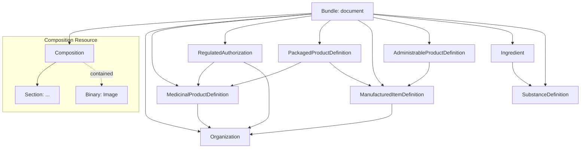

ePI Type 2 focusess on **Product Identification**. It extends the narrative reproduction of Type 1 by adding structured resources for organizations, product definitions, and regulatory context. This type enables machine-level lookup in national drug catalogues.

### Structural Outline
The ePI Type 2 document is a FHIR Bundle that includes the narrative Composition and a suite of "Product" resources. Any images remain **contained** within the Composition.

#### Key Elements Checklist
*   **[Bundle]**
    *   `id`: Unique logical ID for the resource.
    *   `meta`: Must include `versionId`, `lastUpdated`, and `profile` (e.g., `bundle-epi-type2`).
    *   `type`: Must be set to `document`.
    *   `identifier`: Constant document tracking ID.
    *   `entry`: References to all resources in the bundle (Composition, Product, etc.).
*   **[Composition]**
    *   `status`: Typically `final` for released labels.
    *   `relatesTo`: Used to link this ePI to a previous version for automated diffs.
    *   `subject`: Reference to the `MedicinalProductDefinition`.
    *   `author`: Reference to the `Organization` (MAH).
    *   `contained`: Includes `Binary` image resources.
*   **[MedicinalProductDefinition]**
    *   `name`: The full name of the medicinal product.
    *   `type`: Standardized product type (Human medicinal product).
    *   `marketingStatus`: The current commercial status.
*   **[Organization]**
    *   `name`: Legal name of the MAH or Regulatory Authority.
    *   `type`: Role designation (e.g., Marketing Authorization Holder).
*   **[ManufacturedItemDefinition]**
    *   `manufacturedDoseForm`: The physical form (e.g., Tablet).
    *   `unitOfPresentation`: The presentation unit (e.g., 100 mg Tablet).
*   **[AdministrableProductDefinition]**
    *   `administrableDoseForm`: The form as administered (e.g., Solution for injection).
    *   `routeOfAdministration`: How it is given (e.g., Intravenous).
*   **[SubstanceDefinition]**
    *   `code`: Standardized chemical code (e.g., SNOMED CT).
    *   `name`: Official substance name.

### Resource & Element Details
The following table maps the additional resources required for Type 2.

<table style="width:100%; border-collapse: collapse; border: 1px solid #d0d0d0; font-family: -apple-system, BlinkMacSystemFont, 'Segoe UI', Roboto, Helvetica, Arial, sans-serif; font-size: 14px; margin-bottom: 24px;">
  <thead>
    <tr style="background-color: #003087; color: #ffffff;">
      <th style="padding: 12px; border: 1px solid #d0d0d0; text-align: left; width: 20%;">Resource</th>
      <th style="padding: 12px; border: 1px solid #d0d0d0; text-align: left; width: 30%;">Purpose</th>
      <th style="padding: 12px; border: 1px solid #d0d0d0; text-align: left;">Key Elements & Implementation</th>
    </tr>
  </thead>
  <tbody>
    <tr>
      <td style="padding: 10px; border: 1px solid #d0d0d0;"><strong>MedicinalProductDefinition</strong></td>
      <td style="padding: 10px; border: 1px solid #d0d0d0;">The regulatory "anchor" for the product.</td>
      <td style="padding: 10px; border: 1px solid #d0d0d0;">Must include a unique <code>identifier</code> and a reference to the <code>Organization</code>.</td>
    </tr>
    <tr>
      <td style="padding: 10px; border: 1px solid #d0d0d0;"><strong>Organization</strong></td>
      <td style="padding: 10px; border: 1px solid #d0d0d0;">Details the MAH or Regulator.</td>
      <td style="padding: 10px; border: 1px solid #d0d0d0;">Provide the <code>name</code> and <code>identifier</code> (e.g., DUNS or SPOR OrgID).</td>
    </tr>
    <tr>
      <td style="padding: 10px; border: 1px solid #d0d0d0;"><strong>RegulatedAuthorization</strong></td>
      <td style="padding: 10px; border: 1px solid #d0d0d0;">Documents the product license.</td>
      <td style="padding: 10px; border: 1px solid #d0d0d0;">Links the <code>subject</code> (Product) and <code>holder</code> (Org). Include the <code>identifier</code> (license number).</td>
    </tr>
    <tr>
      <td style="padding: 10px; border: 1px solid #d0d0d0;"><strong>PackagedProductDefinition</strong></td>
      <td style="padding: 10px; border: 1px solid #d0d0d0;">Describes the presentation (e.g., box of 20).</td>
      <td style="padding: 10px; border: 1px solid #d0d0d0;">Include <code>package</code> hierarchy and <code>containedItem</code> (linking to the manufactured form).</td>
    </tr>
    <tr>
      <td style="padding: 10px; border: 1px solid #d0d0d0;"><strong>ManufacturedItemDefinition</strong></td>
      <td style="padding: 10px; border: 1px solid #d0d0d0;">Focuses on the physical item produced.</td>
      <td style="padding: 10px; border: 1px solid #d0d0d0;">Specify <code>manufacturedDoseForm</code> and reference the <code>Organization</code> (manufacturer).</td>
    </tr>
    <tr>
      <td style="padding: 10px; border: 1px solid #d0d0d0;"><strong>AdministrableProductDefinition</strong></td>
      <td style="padding: 10px; border: 1px solid #d0d0d0;">Details the product in its final usable state.</td>
      <td style="padding: 10px; border: 1px solid #d0d0d0;">Define <code>administrableDoseForm</code> and <code>routeOfAdministration</code>.</td>
    </tr>
    <tr>
      <td style="padding: 10px; border: 1px solid #d0d0d0;"><strong>Ingredient</strong></td>
      <td style="padding: 10px; border: 1px solid #d0d0d0;">Details the chemical makeup.</td>
      <td style="padding: 10px; border: 1px solid #d0d0d0;">Define <code>role</code> (active/excipient) and <code>strength</code>. Links to the <code>SubstanceDefinition</code>.</td>
    </tr>
    <tr>
      <td style="padding: 10px; border: 1px solid #d0d0d0;"><strong>SubstanceDefinition</strong></td>
      <td style="padding: 10px; border: 1px solid #d0d0d0;">Technical definition of the chemical substance.</td>
      <td style="padding: 10px; border: 1px solid #d0d0d0;">Provide <code>code</code> and <code>name</code>. Required for all active ingredients.</td>
    </tr>
  </tbody>
</table>

### Conceptual Workflow
Building a Type 2 ePI requires integrating regulatory Master Data with the narrative content:

1.  **Map Master Data**: Extract product IDs, MAH details, and authorization dates from your regulatory systems.
2.  **Generate Structured Resources**: Create FHIR representations of the Product, Org, Authorization, and Ingredients.
3.  **Cross-Link Resources**: Ensure the `MedicinalProductDefinition` is correctly linked to the MAH (Organization) and the Authorization.
4.  **Reference Product in Composition**: Update the `Composition.subject` to point to the `MedicinalProductDefinition`.
5.  **Assemble and Validate**: Package all resources into a `Bundle` and validate against the [Type 2 Profile](StructureDefinition-bundle-epi-type2.html).

### Implementation Examples
Refer to the following examples for a technical starting point:
- JSON Example: SmPC Type 2 (Structured) ([Source](https://github.com/HL7/emedicinal-product-info/blob/master/input/examples/bundle-epi-type2-example-paracetamol.json))
- JSON Example: PIL Type 2 (Structured) ([Source](https://github.com/HL7/emedicinal-product-info/blob/master/input/examples/bundle-epi-type2-example-paracetamol.json))