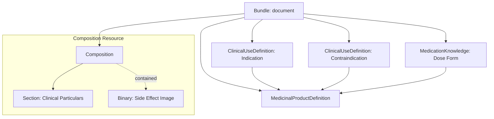

## Building ePI Type 3
ePI Type 3 focusess on **Clinical Guidance**. It builds upon the product identification of Type 2 by adding structured clinical data—such as indications, contraindications, and interaction alerts. This type enables Clinical Decision Support (CDS) in EMRs and mobile apps.

### Structural Outline
The ePI Type 3 document is a FHIR Bundle containing the narrative, product resources (from Type 2), and a set of **ClinicalUseDefinition** resources.

#### Key Elements Checklist
*   **[Bundle]**
    *   `id`: Unique logical ID for the resource.
    *   `meta`: Must include `versionId`, `lastUpdated`, and `profile` (e.g., `bundle-epi-type3`).
    *   `type`: Must be set to `document`.
    *   `entry`: Must include all narrative, product (Type 2), and clinical (Type 3) resources.
*   **[Composition]**
    *   `section`: Narrative sections should cross-reference the structured clinical definitions where appropriate.
*   **[ClinicalUseDefinition]**
    *   `type`: Specifies the clinical category (e.g., `indication`, `contraindication`, `interaction`).
    *   `subject`: Reference to the `MedicinalProductDefinition`.
    *   `category`: Clinical categorization of the use (e.g., Pregnancy, Pediatrics).
    *   `interaction`: Details specific drug-drug or drug-food interactions.
*   **[MedicationKnowledge]**
    *   `clinicalGuideline`: Machine-readable dosing and usage guidelines.
    *   `medicineClassification`: Therapeutic classification (e.g., ATC codes).

### Resource & Element Details
The following table maps the additional clinical resources required for Type 3.

<table style="width:100%; border-collapse: collapse; border: 1px solid #d0d0d0; font-family: -apple-system, BlinkMacSystemFont, 'Segoe UI', Roboto, Helvetica, Arial, sans-serif; font-size: 14px; margin-bottom: 24px;">
  <thead>
    <tr style="background-color: #003087; color: #ffffff;">
      <th style="padding: 12px; border: 1px solid #d0d0d0; text-align: left; width: 25%;">Resource</th>
      <th style="padding: 12px; border: 1px solid #d0d0d0; text-align: left; width: 30%;">Purpose</th>
      <th style="padding: 12px; border: 1px solid #d0d0d0; text-align: left;">Key Elements & Implementation</th>
    </tr>
  </thead>
  <tbody>
    <tr>
      <td style="padding: 10px; border: 1px solid #d0d0d0;"><strong>ClinicalUseDefinition</strong></td>
      <td style="padding: 10px; border: 1px solid #d0d0d0;">Direct capture of safety and usage data.</td>
      <td style="padding: 10px; border: 1px solid #d0d0d0;">Use multiple instances for different types (Indication, Contraindication, Interaction). Link each to the <code>MedicinalProductDefinition</code>.</td>
    </tr>
    <tr>
      <td style="padding: 10px; border: 1px solid #d0d0d0;"><strong>MedicationKnowledge</strong></td>
      <td style="padding: 10px; border: 1px solid #d0d0d0;">Computable dosing and therapeutic info.</td>
      <td style="padding: 10px; border: 1px solid #d0d0d0;">Optional but recommended for precise dosing logic and drug classification mappings.</td>
    </tr>
  </tbody>
</table>

### Conceptual Workflow
Moving to Type 3 requires clinical data extraction and alignment:

1.  **Clinical Coding**: Identify and code indications (e.g., SNOMED CT) and contraindications.
2.  **Define Clinical Definitions**: Create a `ClinicalUseDefinition` for each clinical scenario described in the narrative.
3.  **Link to Product**: Associate all clinical resources with the `MedicinalProductDefinition` via the `subject` field.
4.  **Align Narrative**: Ensure the `Composition` sections (e.g., Section 4.1) align with the structured data in the `ClinicalUseDefinition` resources.
5.  **Validate**: Verify against the [Type 3 Profile](./profiles.md).

### Implementation Examples
Refer to the following examples for a technical starting point:
- **[JSON Example: SmPC Type 3 (Clinical)](bundle-epi-type3-example.html)**
- **[JSON Example: PIL Type 3 (Clinical)](bundle-epi-type3-example-pil.html)**