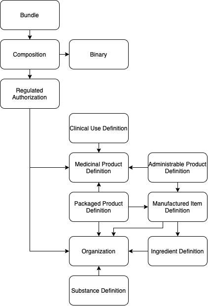

### Step 1: Create foundation resources  
Create the Core ePI document by creating and then bundling these FHIR resources in the order described in section 7. 

NOTE: 
- National Profiles can be built using the Core FHIR ePI profile as is; or they can use a subset of resources and relationships.

The following synthetic medicinal product data is used to throughout this section as an example of common scenarios. This is not an exhaustive list of medicinal product scenarios.

**Example 1 - Blister pack with a solid dosage form**

|Medicinal Product Identifier (MPID)| Invented Name | Strength | Dosage Form | Route of Administration | Primary Packaging  | Pack Size |
|--|--|--|--|--|--|--|
| 123 | Drug X | 30 mg  | Gastro -resistant tablet | Oral use | Blister (PVC/PVDC - alu) | 42 tablets |
| 101 | Drug X | 120 mg | Gastro -resistant tablet | Oral use | Blister (PVC/PVDC - alu) | 90 tablets |

**Example 2 - Pre-filled syringe**

|Medicinal Product Identifier (MPID)| Invented Name | Strength | Dosage Form | Route of Administration | Primary Packaging  | Pack Size |
|--|--|--|--|--|--|--|
| 123 | Drug X | 30 mg  | Gastro -resistant tablet | Oral use | Blister (PVC/PVDC - alu) | 42 tablets |

**Example 3 - Kit with an injection, powder, lyophilized, for solution**

|Medicinal Product Identifier (MPID)| Invented Name | Strength | Dosage Form | Route of Administration | Primary Packaging  | Pack Size |
|--|--|--|--|--|--|--|
| 123 | Drug X | 30 mg  | Gastro -resistant tablet | Oral use | Blister (PVC/PVDC - alu) | 42 tablets |
| 101 | Drug X | 120 mg | Gastro -resistant tablet | Oral use | Blister (PVC/PVDC - alu) | 90 tablets |

Kit 
Part 1 - Vial with powder

Part 2 - Syringe

#### Create Organization resource(s) 
Using the Core ePI Profile as a template, complete one Organization resource for each organization associated with this ePI. Typically that means the Market Authorization Holder, Manufacturer, and regulator.  

Refer to the [Organization profile](http://build.fhir.org/ig/hl7-eu/gravitate-health/StructureDefinition-Organization-uv-epi.html) for detail. 

<figure>
  
  <figcaption>Create Organization</figcaption>
</figure>

#### Create Substance Definition resource(s) 
Using the Core ePI Profile as a template, complete one SubstanceDefinition resource for each active ingredient in the medicinal product. 

Create a reference from the SubstanceDefinition to the Organization resource for the manufacturer or marketing authorization holder. 

Refer to the [SubstanceDefinition Profile](http://build.fhir.org/ig/hl7-eu/gravitate-health/StructureDefinition-SubstanceDefinition-uv-epi.html) for detail. 

<figure>
  
  <figcaption>Create Substance</figcaption>
</figure>

#### Create Manufactured Item Definition resource(s) 
The manufactured item describes the product as contained in its primary package. This is different from the Administrable Product. For example, a powder in a vial and a diluent in a vial are packaged together. The powder is one manufactured item and the diluent is a second manufactured item.  
 
Using the FHIR ePI Profile as a template, complete one Ingredient resource for each Manufactured Item in the ePI.  
 
Create a reference from each ManufacturedItem resource to the corresponding Organization resource for the manufacturer or marketing authorization holder. 

Refer to [ManufacturedItemDefinition Profile](http://build.fhir.org/ig/hl7-eu/gravitate-health/StructureDefinition-ManufacturedItemDefinition-uv-epi.html) for detail. 

(add two examples, one for a product with no transformation (tablet) and one with transformation). 

<figure>
  
  <figcaption>Create Manufactured Item</figcaption>
</figure>

#### Create Medicinal Product Definition resource(s) 
Using the FHIR ePI Profile as a template, complete one MedicinalProductDefinition resource for each authorized presentation of the product referenced in the ePI. 
 
For example, the following two presentations would be four separate medicinal products 

|Medicinal Product Identifier (MPID)| Invented Name | Strength | Dosage Form | Route of Administration | Primary Packaging  | Pack Size |
|--|--|--|--|--|--|--|
| 123 | Drug X | 30 mg  | Gastro -resistant tablet | Oral use | Blister (PVC/PVDC - alu) | 42 tablets |
| 101 | Drug X | 120 mg | Gastro -resistant tablet | Oral use | Blister (PVC/PVDC - alu) | 90 tablets |
 
Refer to [MedicinalProductDefinition Profile](http://build.fhir.org/ig/hl7-eu/gravitate-health/StructureDefinition-MedicinalProductDefinition-uv-epi.html) for detail.

<figure>
  
  <figcaption>Create Medicinal Product</figcaption>
</figure>

#### Create Ingredient resource(s) 
Using the Core ePI Profile as a template, complete one Ingredient resource for each active ingredient and excipient for each medicinal product in the ePI. 

Create a reference from the relevant Ingredient resources to the corresponding ManufacturedItem resource. 

Refer to [Ingredient](http://build.fhir.org/ig/hl7-eu/gravitate-health/StructureDefinition-Ingredient-uv-epi.html) for detail. 

<figure>
  
  <figcaption>Create Ingredient</figcaption>
</figure>

#### Create Administrable Product Definition resource(s) 
The manufactured item describes the product as administering to a patient (after any mixing of multiple components or transformations has been performed). This is different from the manufactured item. For example, a powder in a vial and a diluent in a vial are packaged together. The combined solution made from the powder and diluent, ready for administration to the patient, is the administrable product.  
 
Using the Core ePI Profile as a template, complete one PharmaceuticalProductDefinition resource for each pharmaceutical product described in the ePI.  
 
Create a reference from each PharmaceuticalProductDefinition resource to its corresponding MedicinalProduct resource for this pharmaceutical product. 

Create a reference from each PharmaceuticalProductDefinition resource to the corresponding ManufacturedItem resource used to make the pharmaceutical product. 

Refer to [AdministrableProductDefinition Profile](http://build.fhir.org/ig/hl7-eu/gravitate-health/StructureDefinition-AdministrableProductDefinition-uv-epi.html) for detail. 

(add two examples, one for a product with no transformation (tablet) and one with transformation). 

<figure>
  
  <figcaption>Create Administrable Product</figcaption>
</figure>

#### Create Packaged Product Definition resource(s) 

Using the Core ePI Profile as a template, complete one PackagedProductDefinition resource for each presentation described in the ePI. 

Create a reference from each PackagedProductDefinition resource to its corresponding MedicinalProduct resource for this package. 

Create a reference from each PackagedProductDefinition resource to the corresponding Organization resource for the manufacturer or marketing authorization holder. 

Refer to [PackagedProductDefinition Profile](http://build.fhir.org/ig/hl7-eu/gravitate-health/StructureDefinition-PackagedProductDefinition-uv-epi.html) for detail. 

(Add several examples: (1) simple bottle in carton; (2) simple blisters in carton; (3) complex kit with medicinal product and devices).  
 
INSERT examples that there is one resource per presentation 

|Medicinal Product Identifier (MPID)| Invented Name  | Strength | Dosage Form  | Route of Administration | Primary Packaging  | Pack Size |
|--|--|--|--|--|--|--|
| 123 | Drug X | 30 mg  | Gastro -resistant tablet   | Oral use  | Blister (PVC/PVDC - alu) | 42 tablets |
| 101 | Drug X | 120 mg | Gastro -resistant tablet   | Oral use  | Blister (PVC/PVDC - alu) | 90 tablets |
 
<figure>
  
  <figcaption>Create Packaged Product</figcaption>
</figure>

#### Create Clinical Use Definition resource(s) – Contraindication 
Using the Core ePI Profile as a template, complete one ClinicalUseDefinition resource for each contraindication.  

Create a reference from the ClinicalUseDefinition (contraindication) to the corresponding MedicinalProduct. 

Refer to [ClinicalUseDefinition Profile](http://build.fhir.org/ig/hl7-eu/gravitate-health/StructureDefinition-ClinicalUseDefinition-contraindication-uv-epi.html) for detail. 

<figure>
  
  <figcaption>Create Clinical Use</figcaption>
</figure>

#### Create Clinical Use Definition resource(s) - Indication 
Using the Core ePI Profile as a template, complete one ClinicalUseDefinition resource for each Indication. 

Create a reference from each ClinicalUseDefinition (Indication) to the corresponding MedicinalProduct. 

Refer to [ClinicalUseDefinition Profile](http://build.fhir.org/ig/hl7-eu/gravitate-health/StructureDefinition-ClinicalUseDefinition-contraindication-uv-epi.html) for detail.

<figure>
  
  <figcaption>Create Clinical Use - Indication</figcaption>
</figure>

#### Create Clinical Use Definition resource - Interaction 
Using the Core ePI Profile as a template, complete one ClinicalUseDefinition resource for each Interaction. 

Create a reference each ClinicalUseDefinition (Interaction) to the corresponding MedicinalProduct. 

Refer to [ClinicalUseDefinition Profile](http://build.fhir.org/ig/hl7-eu/gravitate-health/StructureDefinition-ClinicalUseDefinition-contraindication-uv-epi.html) for detail.

<figure>
  
  <figcaption>Create Clinical Use - Interaction</figcaption>
</figure>

#### Create Clinical Use Definition resource - Undesirable Effect 
Using the Core ePI Profile as a template, complete one ClinicalUseDefinition resource for each Undesirable Effect. 

Create a reference from each ClinicalUseDefinition (Undesirable Effect) to the corresponding MedicinalProduct. 

Refer to [ClinicalUseDefinition Profile](http://build.fhir.org/ig/hl7-eu/gravitate-health/StructureDefinition-ClinicalUseDefinition-contraindication-uv-epi.html) for detail.

<figure>
  
  <figcaption>Create Clinical Use - undesireable effect</figcaption>
</figure>

#### Create Clinical Use Definition resource - Warning 
Using the Core ePI Profile as a template, complete one ClinicalUseDefinition resource for each Warning. 

Create a reference from each ClinicalUseDefinition (Warning) to the corresponding MedicinalProduct. 

INSERT reference to the Profile page. 

<figure>
  
  <figcaption>Create Clinical Use - warning</figcaption>
</figure>

#### Create Regulated Authorization resource 
Using the Core ePI Profile as a template, complete one RegulatedAuthorization resource for each medicinal product associated with this ePI. For example, if there are four medicinal products then there will be four RegulatedAuthorization resources. 

Refer to [RegulatedAuthorization Profile](http://build.fhir.org/ig/hl7-eu/gravitate-health/StructureDefinition-RegulatedAuthorization-uv-epi.html) for detail.
 
NOTE:  
- Depending on the jurisdiction there will either be (1) one authorization per medicinal product (i.e., resulting in many RegulatedAuthorization resources); or (2) one authorization for all medicinal products (i.e., resulting in one RegulatedAuthorization resource). Refer to the regional profile for confirmation on which approach is required. 

<figure>
  
  <figcaption>Create Regulated Authorization</figcaption>
</figure>

#### Create Binary resource 
Convert each image in the ePI to Base64. 

Using the FHIR ePI Profile as a template, complete one Binary resource for each image in the ePI. Add the Base64 version of the image to the Binary resource. 

The Binary can also be used to create a cross-reference linking to an outside object like a video. 

Refer to [Binary Profile](http://build.fhir.org/binary.html) for detail. 

<figure>
  
  <figcaption>Create Binary</figcaption>
</figure>

#### Create Composition resource 
Using the FHIR ePI Profile as a template, complete one Composition resource for each ePI document. 

Reference the Composition resource to each Binary. The reference to the Binary is made from the narrative text of the Composition resource’s @text element. 

Reference the Composition resource to each Regulated Authorization from the @subject element. 

The section/@Title is the display text of the section heading and sub-section heading prescribed by the relevant national health authority. For example, ‘2. Qualitative and quantitative composition’ or ‘4.1 Therapeutic indications’ from the EMA’s Quality Review of Document (QRD) template for the SmPC. 

The section/@code is the code for the corresponding section heading or sub-section heading prescribed by the relevant national health authority. 

NOTE:  
- Create one Composition for each ePI document; e.g., one Composition resource for the healthcare practitioner document and another Composition resource for the Patient Insert document.
- Create one Composition for each translation; e.g., one Composition for the French version of the ePI document and another Composition resource for a Spanish version of the ePI document.

Refer to [Composition Profile](http://build.fhir.org/ig/hl7-eu/gravitate-health/StructureDefinition-Composition-uv-epi.html) for detail.

<figure>
  
  <figcaption>Create Composition</figcaption>
</figure>

### Step 2: Create Bundle 
Using the Core ePI Profile as a template, complete one Bundle resource for each ePI document.  

Complete the Bundle resource by referencing it to only one Composition plus all other resources completed in Step 1. Refer to sample ePI #1 and sample ePI #2 for examples of how this is done. 

NOTE: 
- There is one bundle for each ePI document. E.g., one Bundle resource for each healthcare practitioner document, patient information document and their respective translations.
- As per the FHIR Document specification, there shall not be any loose resources; i.e., all resources contained in the Bundle must be referenced.
- INSERT reference to the Profile page.
- Step 3: Create a List of Bundles
- Using the FHIR ePI Profile as a template, complete one List resource that includes a reference to the Bundle created in section 6.2.
- INSERT reference to the Profile page.
- INSERT another figure showing the List of Bundles for the various ePI documents
- INSERT call out the options to list all bundles in the List vs just List the set ids for the bundles and all documents in the List vs separate Lists for documents and translations.

Refer to [Bundle Profile](http://build.fhir.org/ig/hl7-eu/gravitate-health/StructureDefinition-Bundle-uv-epi.html) for detail.

<figure>
  
  <figcaption>Create Bundle </figcaption>
</figure>

### Step 3: Create List

<figure>
  
  <figcaption>Create List</figcaption>
</figure>

### Sample ePI data 
European Union Samples
- Centrally Authorized Product (CAP)
    - Summary of Product Characteristics (SmPC)
    - Package Leaflet
- Nationally Authorized Product (NAP)
    - Summary of Product Characteristics (SmPC)
    - Package Leaflet

United States Samples
- Prescription Drug Product Label

Japanese Samples
- Package Insert (JPI)

INSERT a reference to sample #1 and sample #2 
INSERT consider using Monuril as an example since it is used in the UNICOM example 